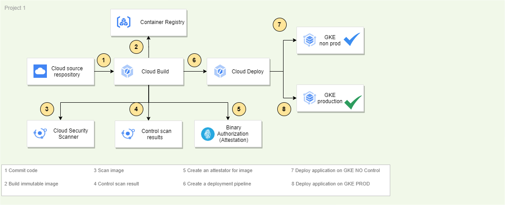
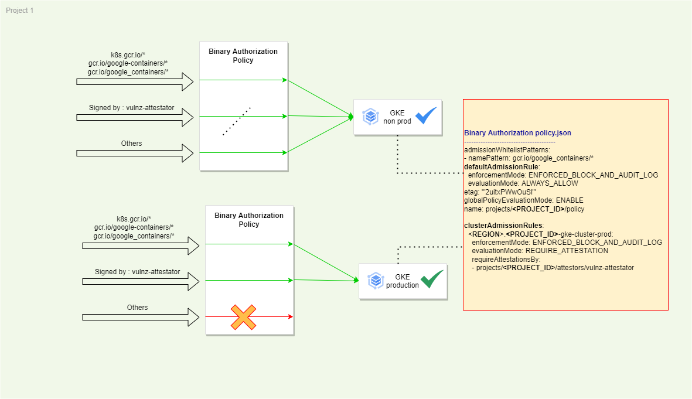
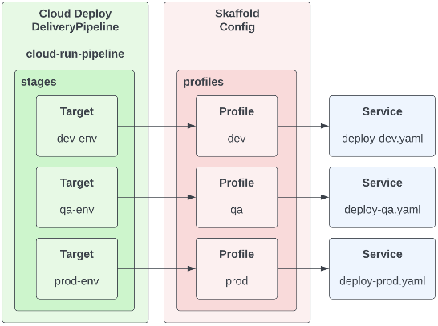
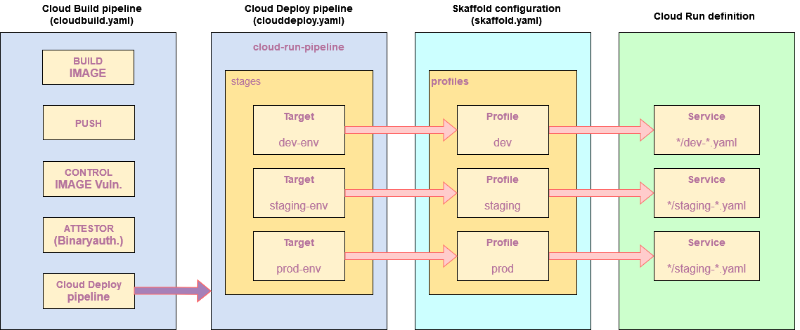
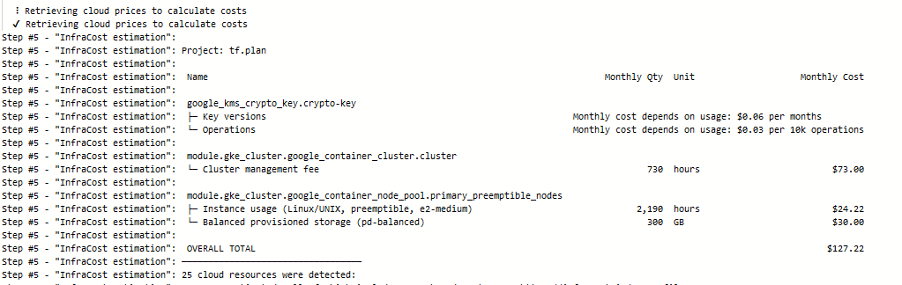
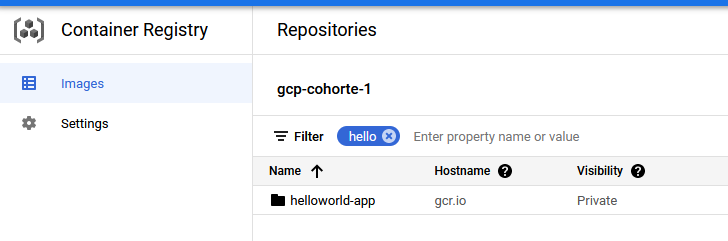
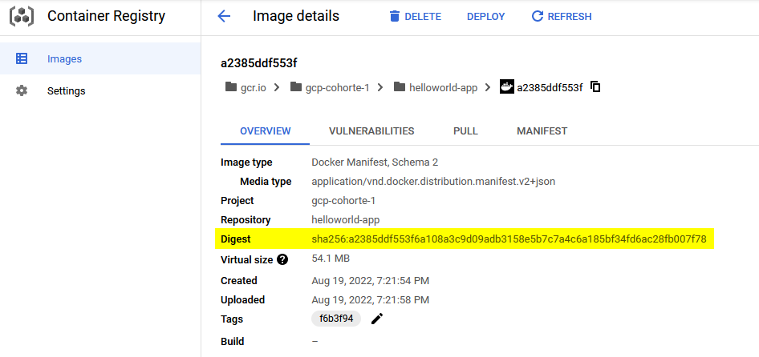
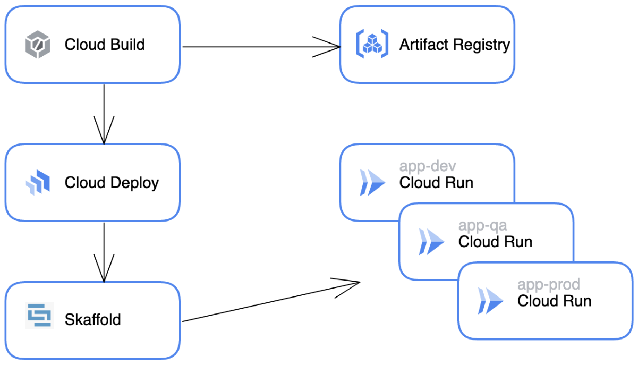

#Deploy application with Binary Authorization & Cloud Build & Cloud Deploy on CloudRUN and GKE

Purpose : 
- Scan docker image to control CVE vuln
- Sign docker images
- Control deployment on GKE 
- Deploy signed docker image on cloud run



With binaryauthorization policy, permission can differ per GKE cluster


**Terminology**
* **Binary Authorization** is a deploy time security service provided by Google that ensures that only trusted containers are deployed in our GKE cluster. It uses a policy driven model that allows us to configure security policies. Behind the scenes, this service talks to the Container Analysis service.
* **Container Analysis** is an API that is used to store trusted metadata about our software artifacts and is used during the Binary Authorization process
* **Attestor** is a person or process that attests to the authenticity of the image
* **Note** is a piece of metadata in Container Analysis storage that is associated with an Attestor
* **Attestation** is a statement from the Attestor that an image is ready to be deployed. In our case we will use an attestation that refers to the signing of our image

* What is **Cloud Build**?
With Cloud Build you can build software quickly across all programming languages.

* What is **Cloud Deploy**?
Cloud Deploy is a fully managed continuous delivery service. With Cloud Deploy you can create deployment pipelines for GKE, Anthos and Cloud Run.

* What is **Cloud Run**?
With Cloud Run you can deploy scalable containerized applications written in any language (including Go, Python, Java, Node.js, .NET, and Ruby) on a fully managed platform.

* What is **Skaffold**?
Skaffold is a command-line tool that enables continuous development for Kubernetes-native applications. Cloud Deploy uses Skaffold for render and deploy operations.


## Configuration files

Deploy pipeline file : deploy/clouddeploy.yaml
Skaffold configuration file : config/skaffold.yaml


Pipeline description


======

On the guideline you'll retrieve :
Step 5 : Setup the Cloud Build pipeline for CloudRUN application
| Chapter | Description |
| :---: | :---: | :---: |
| `1` | Solution 1 : Manual deployment |
| `2` | Solution 2 : Infrastructure deployment TERRAFORM & CloudBuild |
| `3` | Step 3 : Setup the Cloud Build pipeline for Cloud Run application |
| `4` | Step 4 : Setup the Cloud Build pipeline for GKE application |
| `5` | Step 5 : Setup the Cloud Build pipeline for CloudRUN application |


======

# :hammer_and_wrench: Solution 1 : Manual deployment
## Requirements
[*]-Authenticate on GCP
```
gcloud auth application-default login
gcloud config set project <PROJECT_NAME>
```

[*]-Enable GCP services
```
gcloud services enable \
  artifactregistry.googleapis.com \
  cloudbuild.googleapis.com \
  clouddeploy.googleapis.com \
  containeranalysis.googleapis.com \
  containerregistry.googleapis.com \
  ondemandscanning.googleapis.com 

//enable GKE to create and manage your cluster
gcloud services enable container.googleapis.com
//enable BinAuthz to manage a policy on the cluster
gcloud services enable binaryauthorization.googleapis.com
//enable KMS to manage cryptographic signing keys
gcloud services enable cloudkms.googleapis.com
//enable cloudrun with binaryauthorization control
gcloud run services update cloudrun.googleapis.com --binary-authorization=default

```


Set the Cloud project where you deploy and manage all resources used in this tutorial:
```
export PROJECT_ID="${DEVSHELL_PROJECT_ID}"
```

Set the region in which you deploy these resources:
```
export REGION="europe-west1 
export ZONE="europe-west1-c"
```

Set the Cloud Build project number:
```
export PROJECT_NUMBER="$(gcloud projects describe "${PROJECT_ID}" \
  --format='value(projectNumber)')"
```

Set the Cloud Build service account email:
```
export CLOUD_BUILD_SA_EMAIL="${PROJECT_NUMBER}@cloudbuild.gserviceaccount.com"
```

Set GCP permission for cloudbuild account
```
## Add Binary Authorization Attestor Viewer role to Cloud Build Service Account
gcloud projects add-iam-policy-binding $PROJECT \
  --member serviceAccount:${PROJECT_NUMBER}@cloudbuild.gserviceaccount.com \
  --role roles/binaryauthorization.attestorsViewer

## Add Cloud KMS CryptoKey Decrypter role to Cloud Build Service Account (PGP-based Signing)
gcloud projects add-iam-policy-binding $PROJECT \
  --member serviceAccount:${PROJECT_NUMBER}@cloudbuild.gserviceaccount.com \
  --role roles/cloudkms.cryptoKeyDecrypter

## Add Cloud KMS CryptoKey Signer/Verifier role to Cloud Build Service Account (KMS-based Signing)
gcloud projects add-iam-policy-binding $PROJECT \
  --member serviceAccount:${PROJECT_NUMBER}@cloudbuild.gserviceaccount.com \
  --role roles/cloudkms.signerVerifier

## Add Container Analysis Notes Attacher role to Cloud Build Service Account
gcloud projects add-iam-policy-binding $PROJECT \
  --member serviceAccount:${PROJECT_NUMBER}@cloudbuild.gserviceaccount.com \
  --role roles/containeranalysis.notes.attacher

## Add Container Analysis Notes Viewer role to Cloud Build Service Account
gcloud projects add-iam-policy-binding $PROJECT \
  --member serviceAccount:${PROJECT_NUMBER}@cloudbuild.gserviceaccount.com \
  --role roles/containeranalysis.notes.viewer
```

## Create GKE cluster
```
gcloud container clusters create $PROJECT_ID-gke-cluster \
    --region $REGION \
    --node-locations $ZONE \
    --release-channel regular

# Enforce security for GKE and cloud run service
gcloud container clusters update $PROJECT_ID-gke-cluster --region $REGION --binauthz-evaluation-mode=PROJECT_SINGLETON_POLICY_ENFORCE
```


## Setting the Binary Authorization policy

[*]- Create a policy file

```
cat > ./policy.yaml <<
admissionWhitelistPatterns:
- namePattern: docker.io/istio/*
defaultAdmissionRule:
  enforcementMode: ENFORCED_BLOCK_AND_AUDIT_LOG
  requireAttestationsBy:
    - projects/_PROJECT_ID_/attestors/built-by-cloud-build
  evaluationMode: ALWAYS_DENY
globalPolicyEvaluationMode: ENABLE
clusterAdmissionRules:
  # Staging cluster
  global.staging-cluster:
    evaluationMode: REQUIRE_ATTESTATION
    enforcementMode: ENFORCED_BLOCK_AND_AUDIT_LOG
    requireAttestationsBy:
    - projects/_PROJECT_ID_/attestors/vulnz-attestator

  # Production cluster
  global.prod-cluster:
    evaluationMode: REQUIRE_ATTESTATION
    enforcementMode: ENFORCED_BLOCK_AND_AUDIT_LOG
    requireAttestationsBy:
    - projects/_PROJECT_ID_/attestors/vulnz-attestator
    - projects/_PROJECT_ID_/attestors/qa-attestor
EOM
```


[*]- Import binary policy
```
sed -i "s#PROJECT_ID#$PROJECT#g" ./policy.yaml
gcloud container binauthz policy import policy.yaml
```


[*]- Creating signing key
Signing key
```
gcloud kms keyrings create "binauthz" \
  --project "${PROJECT_ID}" \
  --location global
```

- Create an asymmetric Cloud KMS key named vulnz-signer which will be used to sign and verify vulnerability scan attestations

```
gcloud kms keys create "vulnz-signer" \
  --project "${PROJECT_ID}" \
  --location "${REGION}" \
  --keyring "binauthz" \
  --purpose "asymmetric-signing" \
  --default-algorithm "rsa-sign-pkcs1-4096-sha512"
```

[*]- Configuring attestations
Create a Container Analysis note named 'vulnz-note'
```
curl "https://containeranalysis.googleapis.com/v1/projects/${PROJECT_ID}/notes/?noteId=vulnz-note" \
  --request "POST" \
  --header "Content-Type: application/json" \
  --header "Authorization: Bearer $(gcloud auth print-access-token)" \
  --header "X-Goog-User-Project: ${PROJECT_ID}" \
  --data-binary @- << EOF
    {
      "name": "projects/${PROJECT_ID}/notes/vulnz-note",
      "attestation": {
        "hint": {
          "human_readable_name": "Vulnerability scan note"
        }
      }
    }
EOF

```

Create the vulnerability scan attestor
```
gcloud container binauthz attestors create "vulnz-attestator" \
  --project "${PROJECT_ID}" \
  --attestation-authority-note-project "${PROJECT_ID}" \
  --attestation-authority-note "vulnz-note" \
  --description "Vulnerability scan attestor"
```


## Verify attestor creation
```
gcloud container binauthz attestors list
```

Results:
| Name | Note | NUM_PUBLIC_KEYS |
| :---: | :---: | :---: |
| `vulnz-attestator` | projects/<PROJECT_ID>/notes/vulnz-note2 | 0 |


## Add the KMS public key for the attestor's signing key

```
gcloud beta container binauthz attestors public-keys add \
  --project "${PROJECT_ID}" \
  --attestor "vulnz-attestator" \
  --keyversion "1" \
  --keyversion-key "vulnz-signer" \
  --keyversion-keyring "binauthz" \
  --keyversion-location "${REGION}" \
  --keyversion-project "${PROJECT_ID}"
```

## Verify attestor creation with KMS key
```
gcloud container binauthz attestors list
```

Results:
| Name | Note | NUM_PUBLIC_KEYS |
| :---: | :---: | :---: |
| `vulnz-attestator` | projects/<PROJECT_ID>/notes/vulnz-note2 | 1 |


## Build attestator image
Create an image from Google source repository
```
 git clone https://github.com/GoogleCloudPlatform/cloud-builders-community.git
 cd binauthz-attestation
 gcloud builds submit . --config cloudbuild.yaml
```


# MANUAL TEST : Create a Signed attestation

## Retrieve Digest image
Get digest for image like => sha256:xxxxx

```
export CONTAINER_PATH="gcr.io/${PROJECT_ID}/helloworld-app:${TAG}
export TAG=latest

export DIGEST=$(gcloud container images describe ${CONTAINER_PATH}:${TAG} \
    --format='get(image_summary.digest)')
```

## Sign image with attestor

The attestation sign the image
```
export ATTESTOR_ID=vulnz-attestator

gcloud beta container binauthz attestations sign-and-create  \
    --artifact-url="${CONTAINER_PATH}@${DIGEST}" \
    --attestor="${ATTESTOR_ID}" \
    --attestor-project="${PROJECT_ID}" \
    --keyversion-project="${PROJECT_ID}" \
    --keyversion-location="${KEY_LOCATION}" \
    --keyversion-keyring="${KEYRING}" \
    --keyversion-key="${KEY_NAME}" \
    --keyversion="${KEY_VERSION}"
```

## Retrieve attestation
```
gcloud container binauthz attestations list \
   --attestor=$ATTESTOR_ID --attestor-project=${PROJECT_ID}
```


## Deploy image on GKE cluster
```
kubectl create deployment helloworld-app-signed --image="${CONTAINER_PATH}@${DIGEST}"

# Get pods
kubectl create deployment helloworld-app-signed --image="${CONTAINER_PATH}@${DIGEST}"

```

Results
```
helloworld-app-signed-7688dc55f9-ezz6m   1/1       Running   0          50s
```


# :hammer_and_wrench: Solution 2 : Infrastructure deployment TERRAFORM & CloudBuild

The objective of the IAC, deploy and configure infrastructure with : 
. IAM permission for cloudbuild SA
. Configure BinaryAuthorization
. Deploy GKE cluster

## prerequisites 
Generate InfraCost key
```
infracost auth login
```

 
# ================================
# Infrastructure deployment
# ================================
## Add Cloudbuild trigger
You can set up automated deployments of a GitHub repository using the following command, which will cause a build, publish, and deploy to be triggered for every push to any branch. This command allows setting up a build trigger without needing an explicit cloudbuild.yaml file in your repository.

## Go to directory containing this doc.
```
git clone https://github.com/xxxxxx.git

PROJECT=my-project
OWNER=user
REPO=repo
BRANCH_REGEX='^main$'
TF_BUCKET=project-bucket-tf
INFRACOST_KEY=xxxxxxxx

# Copy trigger.yaml and replace values
cp trigger.yaml my-trigger-init.yaml
sed -i "s#OWNER#$OWNER#g" my-trigger-init.yaml
sed -i "s#REPO#$REPO#g" my-trigger-init.yaml
sed -i "s#BRANCH_REGEX#$BRANCH_REGEX#g" my-trigger-init.yaml
sed -i "s#PROJECT_ID#$PROJECT#g" my-trigger-init.yaml

# Configure new cloudbuild-infra.yaml
cp cloudbuild-init.yaml.tpl cloudbuild-infra.yaml
sed -i "s#OWNER#$OWNER#g" cloudbuild-infra.yaml
sed -i "s#REPO#$REPO#g" cloudbuild-infra.yaml
sed -i "s#BRANCH_REGEX#$BRANCH_REGEX#g" cloudbuild-infra.yaml
sed -i "s#PROJECT_ID#$PROJECT#g" cloudbuild-infra.yaml
sed -i "s#TF_BUCKET#$TF_BUCKET#g" cloudbuild-infra.yaml
sed -i "s#INFRACOST_KEY#$INFRACOST_KEY#g" cloudbuild-infra.yaml

gcloud alpha builds triggers create github --trigger-config=my-trigger-init.yaml --project=$PROJECT
```

[*]- Test cloudbuild-infra.yaml file
Sample file : cloudbuild-init.yaml

```
cloud-build-local --config cloudbuild-infra.yaml --dryrun=true  .
```

=> Control trigger is deployed

## Manual infrastructure deployment
```
gcloud builds submit . --config cloudbuild-init.yaml
```

After commit the code cloudbuild will generate infrastructure with an estimation cost for the infrastructure



# ================================
# :newspaper:  Step 3 : Setup the Cloud Build pipeline for Cloud Run application
[*]- Folder : build/01-cloudrun

[*]- Create repository
```
gcloud source repos create hellworld-app --project "${PROJECT_ID}"
```

[*]- copy cloudbuild.yaml file
Adapt content variable for your need


[*]- Test cloudbuild.yaml file
```
cloud-build-local --config cloudbuild.yaml --dryrun=true  .
```

[*]- Create Cloud build Trigger with Substitution Variables

* _ATTESTOR_NAME with the name of the value "vulnz-attestator"
* _COMPUTE_REGION for deployment with the value us-central1 (or the region you chose in the beginning) : "global"
* _KMS_KEY with the value "vulnz-signer"
* _KMS_KEY_VERSION with the value "1".
* _KMS_KEYRING with the value "binauthz"
* _KMS_LOCATION with the value eu-central1 (or the region you chose in the beginning) : "global"
* _PROD_CLUSTER with the value "prod-cluster" for GKE deployment


# Copy trigger.yaml and replace values
```
cp trigger.yaml my-trigger-init.yaml

PROJECT=my-project
OWNER=user
REPO=repo
BRANCH_REGEX='^main$'
ATTESTOR_NAME=vulnz-attestator
COMPUTE_REGION=global
KMS_KEY=vulnz-signer
KMS_KEY_VERSION=1
KMS_KEYRING=binauthz
KMS_LOCATION=global
PROD_CLUSTER=prod-cluster


cp trigger.yaml my-trigger.yaml
sed -i "s#OWNER_#$OWNER#g" my-trigger.yaml
sed -i "s#REPO#$REPO#g" my-trigger.yaml
sed -i "s#BRANCH_REGEX#$BRANCH_REGEX#g" my-trigger.yaml
sed -i "s#PROJECT_ID#$PROJECT#g" my-trigger.yaml
sed -i "s#ATTESTOR__NAME#$ATTESTOR_NAME#g" my-trigger.yaml
sed -i "s#LOCATION#$COMPUTE_REGION#g" my-trigger.yaml
sed -i "s#KMS__KEY#$KMS_KEY#g" my-trigger.yaml
sed -i "s#KMS__KEY__VERSION#$KMS_KEY_VERSION#g" my-trigger.yaml
sed -i "s#KMS__KEYRING#$KMS_KEYRING#g" my-trigger.yaml
sed -i "s#KMS__LOCATION#$KMS_LOCATION#g" my-trigger.yaml
sed -i "s#PROD_CLUSTER#$PROD_CLUSTER#g" my-trigger.yaml


gcloud alpha builds triggers create github --trigger-config=my-trigger-init.yaml --project=$PROJECT
```

Once cloudbuild is triggered, a new image was generate



## Test deployment
[*]- Verification to control image was signed
Go on the container registry : https://console.cloud.google.com/gcr/images/_PROJECT_ID_?authuser=1&project=<PROJECT_NAME>
Retrieve the Digest value from the image


```
gcloud container binauthz attestations list    --project="$(PROJECT_ID)"    --attestor="projects/$(PROJECT_ID)/attestors/vulnz-attestator"    --artifact-url="gcr.io/$(PROJECT_ID)/<IMAGE NAME>@sha256:<DIGEST>
```

---
## Request response
---

```
attestation:
  serializedPayload: ewogICJjcml0aWNhbCI6IHsKICAgICJpZGVudGl0eSI6IHsKICAgICAgImRvY2tlci1yZWZlcmVuY2UiOiAiZ2NyLmlvL2djcC1jb2hvcnRlLTEvdGVzdGJpbmF1dGgiCiAgICB9LAogICAgImltYWdlIjogewogICAgICAiZG9ja2VyLW1hbmlmZXN0LWRpZ2VzdCI6ICJzaGEyNTY6MTQxZGY2M2E4YzA4ZjRkZTg0MjQwOGZhNDllZWQyNDA3Zjk5NDJmNWVmOWUyMmJkZDRlZmFhNTFiODk5MGQ1YSIKICAgIH0sCiAgICAidHlwZSI6ICJHb29nbGUgY2xvdWQgYmluYXV0aHogY29udGFpbmVyIHNpZ25hdHVyZSIKICB9Cn0K
  signatures:
  - publicKeyId: //cloudkms.googleapis.com/v1/projects/_PROJECT_ID_/locations/global/keyRings/binauthz/cryptoKeys/vulnz-signer/cryptoKeyVersions/1
    signature: eEoYcFvHvj7EWVZ2hhHRScefPS7VYEyX73Vc-dwaer_ZqOAeLCBvOjdQdnpmPmTtkZHN1Vj9EaCqYKEVJ3Opum5ZD_AiHbDOMRNEY7EtH_N883MTabZuLoW9VrlSoW6Isq91rUSdkLphp8P8Ds8QUnrVuf1X_o-2QJ-UjwNBYz6AmPxrdTA76iphC4HhEVayB52AOo9uYYTZZqRnmnBrtGUt_JYf537Pit-_D1Q1z97T2PN_MprnZZg6YohY-TFNputYgAsj8pxXmkT6c69tnZeSVPI2NIkmGlLd24E9qAJnJGaGZEcJhIWs8Y4NwriQcjXa6orNM4w9Twl_mw4cJcC1-YTVQ1slmw9kgawbOtR5I-nGXH1IJIagt3azGuyeJBFw0atahUKd0NawpVl9VVxwHigXEUva7OMgMx_ZlOzqtwoXi2j2RXB7QAh3rI-FmxnNa_dkhPbfYgvSplbqtOFx5qyBICGWSdevvTNlGiCZNbGi26Fe3EZ_NB5nRDBugUia9F08r1xAXJZD-ncnOPYOBkdvgTOAMupfPFSeFTkG3b8qA4Y9PHCgCqkvLn1B9U-jJizo8NmmTCGPymNGje5z2CGfpN5NgNBeoskyVsV5Yf54HaNm8TrkuMjfqwXqo7aQhF_amdsToVm8aCghVxxR8l5wYrtzfJwMXwhmTMk=
createTime: '2022-08-19T15:38:34.159772Z'
kind: ATTESTATION
name: projects/_PROJECT_ID_/occurrences/15b44946-7b2f-4550-8ce1-e09f6fbac78f
noteName: projects/_PROJECT_ID_/notes/vulnz-note
resourceUri: https://gcr.io/_PROJECT_ID_/testbinauth@sha256:141df63a8c08f4de842408fa49eed2407f9942f5ef9e22bdd4efaa51b8990d5a
updateTime: '2022-08-19T15:38:34.159772Z'
```


# ================================
# :newspaper:  Step 4 : Setup the Cloud Build pipeline for GKE application

[*]- Folder : build/02-gke

[*]- Create repository
```
gcloud source repos create hellworld-app --project "${PROJECT_ID}"
```

[*]- Create trigger for cloudbuild deployment
1 - Create first your cloudbuild.yaml file
```
PROJECT=my-project
OWNER=user
REPO=repo
BRANCH_REGEX='^main$'
GKE_CLUSTER_NAME=my_gke_cluster
IMAGE=helloworld-app
REGION=europe-west-1

// Copy cloudbuild-sample.yaml and replace values
cp cloudbuild-sample.yaml my-cloudbuild.yaml
sed -i "s#OWNER#$OWNER#g" my-cloudbuild.yaml
sed -i "s#REPO#$REPO#g" my-cloudbuild.yaml
sed -i "s#BRANCH_REGEX#$BRANCH_REGEX#g" my-cloudbuild.yaml
sed -i "s#PROJECT_ID#$PROJECT#g" my-cloudbuild.yaml
sed -i "s#BUILD_IMAGE#$IMAGE#g" my-cloudbuild.yaml
sed -i "s#LOCATION#$REGION#g" my-cloudbuild.yaml
sed -i "s#GKE_CLUSTER_NAME#$GKE_CLUSTER_NAME#g" my-cloudbuild.yaml

gcloud alpha builds trigger create github --trigger-config=my-cloudbuild.yaml --project=$PROJECT

```


[*]- Test my-cloudbuild.yaml file
Sample file : cloudbuild.yaml
```
cloud-build-local --config my-cloudbuild.yaml --dryrun=true  .
```

2 - Create cloudbuild trigger
```
PROJECT=my-project
OWNER=user
REPO=repo
BRANCH_REGEX='^main$'
ATTESTOR_NAME=vulnz-attestator
COMPUTE_REGION=global
KMS_KEY=vulnz-signer
KMS_KEY_VERSION=1
KMS_KEYRING=binauthz
KMS_LOCATION=global
PROD_CLUSTER=prod-cluster


cp trigger.yaml my-trigger.yaml
sed -i "s#OWNER_#$OWNER#g" my-trigger.yaml
sed -i "s#REPO#$REPO#g" my-trigger.yaml
sed -i "s#BRANCH_REGEX#$BRANCH_REGEX#g" my-trigger.yaml
sed -i "s#PROJECT_ID#$PROJECT#g" my-trigger.yaml
sed -i "s#ATTESTOR__NAME#$ATTESTOR_NAME#g" my-trigger.yaml
sed -i "s#LOCATION#$COMPUTE_REGION#g" my-trigger.yaml
sed -i "s#KMS__KEY#$KMS_KEY#g" my-trigger.yaml
sed -i "s#KMS__KEY__VERSION#$KMS_KEY_VERSION#g" my-trigger.yaml
sed -i "s#KMS__KEYRING#$KMS_KEYRING#g" my-trigger.yaml
sed -i "s#KMS__LOCATION#$KMS_LOCATION#g" my-trigger.yaml
sed -i "s#PROD_CLUSTER#$PROD_CLUSTER#g" my-trigger.yaml
```


[*]- Create Cloud build Trigger with Substitution Variables
```
gcloud alpha builds trigger create github --trigger-config=my-trigger.yaml --project=$PROJECT
```

=> Control trigger is deployed

# Infracost
=> Control cloud deploy deployment steps


# :euro: Kubecost
## Step 1: Install Kubecost

```
helm install kubecost/cost-analyzer --debug --wait --namespace kubecost --name kubecost \
    --set kubecostToken="<INSERT_YOUR_TOKEN>" \
    --set prometheus.nodeExporter.enabled=false \
    --set prometheus.serviceAccounts.nodeExporter.create=false
```


- [_] Create  proxy to access kubecost interface

```
kubectl port-forward --namespace kubecost deployment/kubecost-cost-analyzer 9090
```

* Test to deploy attest image
```
kubectl run nginx --image=nginx -n default
```
Results
```
Error from server (VIOLATES_POLICY): admission webhook "imagepolicywebhook.image-policy.k8s.io" denied the request: Image nginx denied by Binary Authorization default admission rule. Denied by always_deny admission rule
```


# ================================
# :newspaper:  Step 5 : Setup the Cloud Build pipeline for CloudRUN application
Setup CloudRUN with GCP services :
- Cloud Deploy
- BinaryAuthorization
- Artifactory
- CloudBuild




[*]- Create trigger for cloudbuild deployment
1 - Create first your cloudbuild.yaml file
```
cd build/04-cloudrun-with-clouddeploy/
PROJECT=my-project
OWNER=user
REPO=repo
BRANCH_REGEX='^main$'
GKE_CLUSTER_NAME=my_gke_cluster
IMAGE=helloworld-app
REGION=europe-west-1

// Copy cloudbuild-sample.yaml and replace values
cp cloudbuild-sample.yaml my-cloudbuild.yaml
sed -i "s#OWNER#$OWNER#g" my-cloudbuild.yaml
sed -i "s#REPO#$REPO#g" my-cloudbuild.yaml
sed -i "s#BRANCH_REGEX#$BRANCH_REGEX#g" my-cloudbuild.yaml
sed -i "s#PROJECT_ID#$PROJECT#g" my-cloudbuild.yaml
sed -i "s#BUILD_IMAGE#$IMAGE#g" my-cloudbuild.yaml
sed -i "s#LOCATION#$REGION#g" my-cloudbuild.yaml
sed -i "s#GKE_CLUSTER_NAME#$GKE_CLUSTER_NAME#g" my-cloudbuild.yaml

gcloud alpha builds trigger create github --trigger-config=my-cloudbuild.yaml --project=$PROJECT

```


[*]- Test my-cloudbuild.yaml file
Sample file : cloudbuild.yaml
```
cloud-build-local --config my-cloudbuild.yaml --dryrun=true  .
```

2 - Create cloudbuild trigger
```
PROJECT=my-project
OWNER=user
REPO=repo
BRANCH_REGEX='^main$'
ATTESTOR_NAME=vulnz-attestator
COMPUTE_REGION=global
KMS_KEY=vulnz-signer
KMS_KEY_VERSION=1
KMS_KEYRING=binauthz
KMS_LOCATION=global
PROD_CLUSTER=prod-cluster


cp trigger.yaml my-trigger.yaml
sed -i "s#OWNER_#$OWNER#g" my-trigger.yaml
sed -i "s#REPO#$REPO#g" my-trigger.yaml
sed -i "s#BRANCH_REGEX#$BRANCH_REGEX#g" my-trigger.yaml
sed -i "s#PROJECT_ID#$PROJECT#g" my-trigger.yaml
sed -i "s#ATTESTOR__NAME#$ATTESTOR_NAME#g" my-trigger.yaml
sed -i "s#LOCATION#$COMPUTE_REGION#g" my-trigger.yaml
sed -i "s#KMS__KEY#$KMS_KEY#g" my-trigger.yaml
sed -i "s#KMS__KEY__VERSION#$KMS_KEY_VERSION#g" my-trigger.yaml
sed -i "s#KMS__KEYRING#$KMS_KEYRING#g" my-trigger.yaml
sed -i "s#KMS__LOCATION#$KMS_LOCATION#g" my-trigger.yaml
sed -i "s#PROD_CLUSTER#$PROD_CLUSTER#g" my-trigger.yaml


gcloud deploy releases create helloworld-app-9fa592b6496e --region=europe-west1 --delivery-pipeline=cloud-run-pipeline --images=gke-container=gcr.io/<PROJECT_ID>/helloworld-app@sha256:XXXXX --skaffold-file=skaffold.yaml
```

# ====================================
# :wrench: Build image for binauthz-attestation
https://github.com/GoogleCloudPlatform/cloud-builders-community.git
https://github.com/GoogleCloudPlatform/cloud-builders-community/tree/master/binauthz-attestation

# Reference
https://cloud.google.com/architecture/binary-auth-with-cloud-build-and-gke#setting_up_the_cloud_build_pipeline

# Codelabs
https://codelabs.developers.google.com/codelabs/cloud-binauthz-intro#1

# GKE / Binary
https://medium.com/google-cloud/automating-container-security-on-gke-with-binary-authorization-and-circleci-7efa7a6be2a7

#
